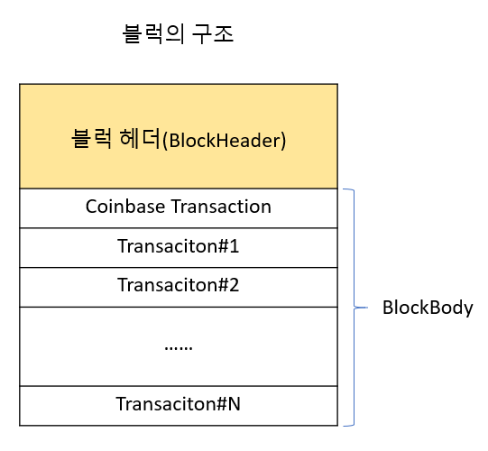

# 블럭

http://cryptostudy.xyz/crypto/article/201-%EB%B8%94%EB%9F%AD-Block

## 블럭(Block)이란?
블럭(Block)은 데이타들의 집합을 포함하는 컨테이너로서, 블럭체인에서의 블럭은 이전 블럭의 해시값을 가지고 있어서 블럭들을 체인으로 연결하게 된다. 이는 블럭체인 내에 있는 임의의 블럭을 위변조하는 것을 방지하기 위한 것으로, 블럭의 데이타를 변경 불가능한 데이타로 만들게 된다.

비트코인 블럭체인의 경우, 각 블럭은 자신의 블럭 해시값을 동적으로 계산하고 이를 별도로 메인 블럭 파일에 저장하지는 않는다. 하지만, 블럭을 체인으로 연결하기 위해 각 블럭은 이전블럭의 해시값을 가지게 되고, 이는 메인 블럭 파일(blocks/blk*.dat)에 저장된다.

비트코인에는 메인 블럭 파일과 더불어 보조적인 역활을 하는 인덱스 파일들(blocks/index/*)이 있으며, 여기에는 각 블럭에 대한 메타 데이타(metadata)를 저장하게 된다. 이 인덱스 파일은 LevelDB를 사용한 DB로서, 각 블럭 해시값에 상응하는 메타 데이타를 가지고 있다. 인덱스 파일에는 특정 블럭이 어느 블럭파일 안의 어디에 위치하는지, 블럭의 헤더 내용은 무엇인지, 트랜잭션 수는 얼마나 되는지 등의 정보를 가지고 있다.

## 블럭의 구조
블럭은 블럭헤더(Block Header)와 블럭바디(Block Body)로 구성되어 있는데, Block Header는 블럭에 대한 기본적인 정보를 가지고 있으며, Block Body에는 여러 트랜잭션(transaction)들이 순차적으로 저장되어 있다.

