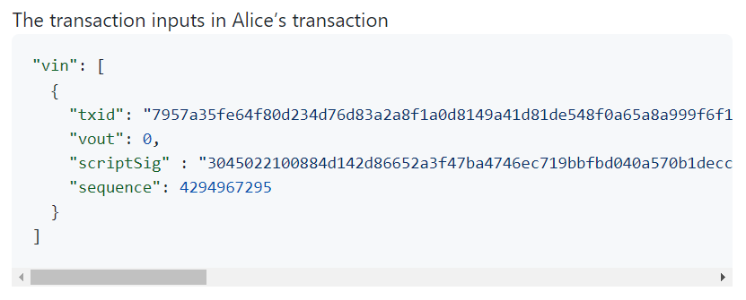

# 트랜잭션 입력

트랜잭션 입력은 자신이 사용할 수 있는 이전 트랜잭션 출력([[UTXO]], Unspent Transaction Output)을 자신의 [[개인키]] (private key)로 [[서명]]하여 코인을 사용하도록 지정하는 것이다.

## 트랜잭션 입력의 구조

트랜잭션 입력은 크게 2개의 부분으로 구성되는데, 첫번째 부분은 어떤 UTXO를 사용할 지를 지정하는 부분이고, 두번째 부분은 자신이 그 UTXO를 사용할 수 있는 개인키를 가지고 있다는 것을 증명하기 위해 [[디지털 서명]]signature을 입력 스크립트에 지정하는 부분이다. U
TXO 트랜잭션 출력의 스크립트와 그에 매핑되는 트랜잭션 [[입력 스크립트]]를 합쳐 그 사용자가 코인을 사용할 수 있을 지를 결정하게 된다.

트랜잭션 입력은 위 코드에서와 같이 5개의 데이타 필드를 갖는다. 처음 2개의 필드는 아웃포인트(outpoint)라고 불리우는데, 이전 UTXO를 지정하기 위한 것으로 그 트랜잭션의 해시값과 트랜잭션 내에서 자신이 사용하고자 트랜잭션 출력의 위치(0 ~ n 인덱스)를 나타낸다. 
하나의 트랜잭션은 복수 개의 트랜잭션 입력(transaction input)과 복수 개의 트랜잭션 출력(transaction output)을 가질 수 있으므로, [[Vout]]필드는 지정된 트랜잭션([[TxId]]) 내에서 사용할 트랜잭션 출력(transaction output)의 위치를 인덱스로 나타낸 것이다.

트랜잭션 출력에 있는 비트코인 스크립트를 흔히 [[locking script]] 라고 부르고, 트랜잭션 입력에 있는 스크립트를 흔히 [[unlocking script]] 라고 부른다. 즉, 트랜잭션 입력에서의 스크립트는 잠겨 있는 코인을 풀고 소비하기 위해 사용된다는 점에서 unlocking script 라고 부른다. 보통 이 입력 스크립트에는 서명이 들어가기 때문에 ScriptSig으로 표현되기도 한다.

비트코인의 트랜잭션 입력 스크립트, 즉 [[ScriptSig]] 은 [[DER 인코딩]] (Distinguished Encoding Rules Encoding)을 사용하여 저장하고 있다. ScriptSig는 기본적으로 "디지탈 서명"[[디지털 서명]]과"public key"[[공개키]]를 포함하고 있다. 이 ScriptSig는 트랜잭션 출력(transaction output)의 ScriptPubKey와 함께 완전한 비트코인 스크립트를 구성하게 되고, 이것이 실행되어 트랜잭션이 타당한 지를 결정하게 된다.

[//begin]: # "Autogenerated link references for markdown compatibility"
[UTXO]: UTXO "UTXO"
[Vout]: ../Vout "Vout"
[TxId]: ../TxId "TxId"
[locking script]: <locking script> "locking script"
[unlocking script]: <unlocking script> "unlocking script"
[ScriptSig]: ScriptSig "ScriptSig"
[//end]: # "Autogenerated link references"